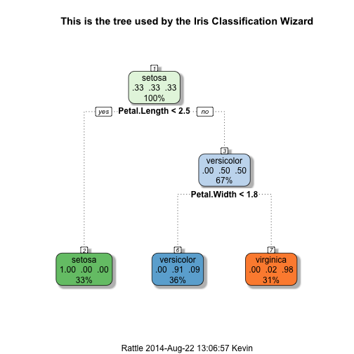

## Introduction

* Botanists need an easy way to classify irises
* Thanks to the power of data, it's possible to classify irises based on a small number of inputs
* The Iris Classification Wizard uses the power of regression trees and Shiny to provide a simple tool for iris classification

---

## How It Works

The Wizard applies the rpart function to the iris dataset to come up with a classification tree.


```r
data(iris)
require(rpart)
modFit <- rpart(Species ~ Petal.Length + Petal.Width , data=iris)
```

The Wizard then makes a prediction of the iris species based on the user input. For example:


```r
newdata=data.frame(Petal.Length=3, Petal.Width=2)
predict(modFit, newdata=newdata)
```

```
##   setosa versicolor virginica
## 1      0    0.02174    0.9783
```

---

## The Classification Tree


```r
require(rattle)
fancyRpartPlot(modFit, main="This is the tree used by the Iris Classification Wizard")
```

 

---

## Applying the Prediction

The Wizard takes the probability values and uses if/then statements to report the species:


```r
if (predict(modFit, newdata=newdata)[1] > .8 ){
    return(c("setosa"))
    }
else if (predict(modFit, newdata=newdata)[2] > .8 ){
    return(c("versicolor"))
    }
else {
    return(c("virginica"))
    }
```

---

## Conclusion

The Iris Classification Wizard uses sophisticated data analysis to provide botanists with an accurate classification tool.  It will help reduce errors and give botanists more time to focus on their field work.

I hope you enjoy the tool and find it useful!

